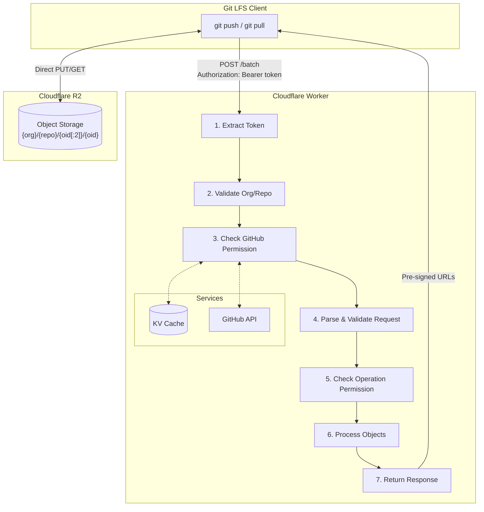
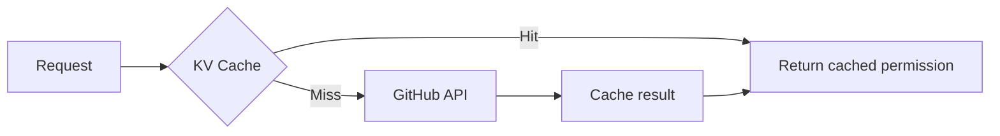

# Architecture

## Overview

gitLFSflare is a Git LFS server built on Cloudflare Workers that uses R2 for object storage. It authenticates users via GitHub API and generates pre-signed URLs for direct client-to-R2 transfers.

## System Design



## Components

### Services

| Service | File | Responsibility |
|---------|------|----------------|
| **Auth** | `src/services/auth.ts` | Token parsing and validation |
| **GitHub** | `src/services/github.ts` | GitHub API permission checking |
| **Cache** | `src/services/cache.ts` | KV-based permission caching |
| **R2** | `src/services/r2.ts` | Pre-signed URL generation |
| **LFS** | `src/services/lfs.ts` | Batch request processing |

### Libraries

| Library | File | Responsibility |
|---------|------|----------------|
| **Validation** | `src/lib/validation.ts` | OID, size, org validation |

### Application

| File | Responsibility |
|------|----------------|
| `src/app.ts` | Hono routes and request handling |
| `src/index.ts` | Worker entry point |

## Request Flow

### 1. Token Extraction

```typescript
// Supports both formats
Authorization: Bearer ghp_xxx        // LFS standard
Authorization: Basic base64(user:ghp_xxx)  // Git HTTP
```

### 2. Organization & Repository Validation (Fail-Fast)

Organization and repository are validated **before** calling GitHub API to:
- Prevent quota waste on unauthorized requests
- Fail fast for better performance
- Enforce security boundary

```typescript
if (!ALLOWED_ORGS.includes(org)) {
  return 403 "Organization not allowed"
}
if (!validateRepoName(repo)) {
  return 400 "Invalid repository name"
}
```

### 3. Permission Checking (Cached)



Cache key format: `perm:{sha256(token)}:{org}/{repo}`

### 4. Operation Permission

| Permission | Download | Upload |
|------------|----------|--------|
| `admin` | Yes | Yes |
| `write` | Yes | Yes |
| `read` | Yes | No |
| `none` | No | No |

### 5. Pre-signed URL Generation

URLs are generated using AWS Signature V4:

```typescript
// Upload URL (PUT)
generateUploadUrl(env, org, repo, oid) → signed PUT URL

// Download URL (GET)
generateDownloadUrl(env, org, repo, oid) → signed GET URL
```

## Object Key Sharding

Objects are stored with sharded keys for better R2 performance:

```
{org}/{repo}/{oid[:2]}/{oid}

Example:
acme-corp/my-repo/ab/abcdef1234567890abcdef1234567890abcdef1234567890abcdef1234567890
```

## Error Handling

### Request-Level Errors

| Status | Condition |
|--------|-----------|
| 400 | Invalid repository name format |
| 401 | Missing or invalid token |
| 403 | Organization not allowed, no access, insufficient permissions |
| 409 | Unsupported hash algorithm (only sha256 supported) |
| 413 | Batch request exceeds 100 objects limit |
| 422 | Invalid request body (JSON parse error, invalid operation, invalid OID/size) |
| 429 | GitHub rate limit exceeded |
| 502 | GitHub API error (5xx) |
| 500 | Internal server error |

### Per-Object Errors

Batch requests return per-object errors without failing the entire request:

```json
{
  "transfer": "basic",
  "objects": [
    { "oid": "abc...", "size": 1024, "actions": { "upload": {...} } },
    { "oid": "def...", "size": 2048, "error": { "code": 422, "message": "Size mismatch" } }
  ]
}
```

**Note:** Downloads always return pre-signed URLs without checking object existence (performance optimization). Clients handle 404s directly from R2. Upload operations check object existence and may return per-object errors (e.g., size mismatch).

## Security Model

### Authentication

1. **Token Validation**: Only accept valid GitHub token prefixes (`ghp_`, `github_pat_`, `ghs_`)
2. **Length Limit**: Reject tokens >1000 chars
3. **Character Validation**: Only alphanumeric + underscore

### Authorization

1. **Organization Allowlist**: Only configured orgs can use the server
2. **GitHub Permission Check**: Actual repository permissions from GitHub API
3. **Operation-Specific**: Upload requires write/admin, download requires read+

### Token Security

- Tokens are **never logged**
- Cache keys use **SHA-256 hashes** of tokens
- Error messages **never expose tokens**

### URL Security

- Pre-signed URLs are **time-limited** (configurable, default 15 min)
- URLs are **operation-specific** (PUT for upload, GET for download)
